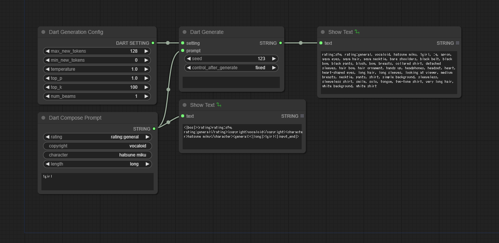

# ComfyUI-Dart
  
日本語版READMEは[こちら](README.jp.md)。

- Custom node for [ComfyUI](https://github.com/comfyanonymous/ComfyUI).
- Add nodes that generates danbooru tags by [Dart(Danbooru Tags Transformer)](https://huggingface.co/p1atdev/dart-v1-sft).

## Installation
```
cd <ComfyUI directory>/custom_nodes
git clone https://github.com/nkchocoai/ComfyUI-Dart.git
```

## Nodes
### Dart Generate
- Generate prompt by [Dart(Danbooru Tags Transformer)](https://huggingface.co/p1atdev/dart-v1-sft).
- See the following URL for the syntax of prompt.
  - https://huggingface.co/p1atdev/dart-v1-sft#prompt-guidde

### Dart Compose Prompt
- Compose input "prompt" of Dart Generate node.

### Dart Generation Config
- Output input "config" of Dart Generate node.
